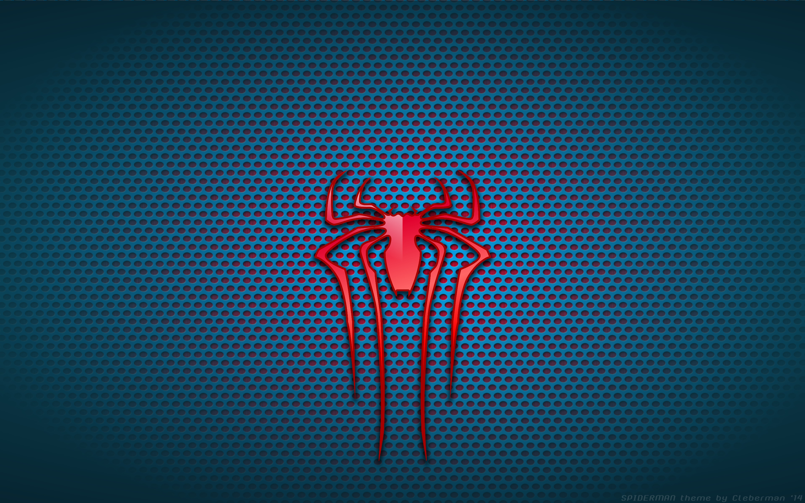

# Desafio Spider-Man Multiversos

## 👋 Bem-vindo(a)
Olá, meu nome é Leonardo Braga. E esse é o desafio para o bootcamp da RiHappy + DIO, para Front-End.

## 🎉 Awesome Spiedr-Man Page

Bem-vindo a **Página Multiverso Homem-Aranha**! Neste repositório, você encontrará uma página divertida baseado nos famosos filmes da franquia "Spider-Man". Este projeto não apenas oferece entretenimento, mas também demonstra várias técnicas avançadas de desenvolvimento de páginas com JavaScript.

### 💻 Tecnologias Utilizadas

  

- HTML5 e CSS3 para a estrutura e aparência das páginas.
- JavaScript para a lógica de programação e interatividade.
- Sprites e imagens customizadas para criar a estética única do universo de Spider-Man.

### 👓 Como acessar

1. Clone este repositório para sua máquina local.
2. Abra o arquivo `index.html` em seu navegador web.
3. Use o mouse para links e para interagir.
4. Divirta-se explorando!

## 🔗 Links auxiliares

- [W3C - World Wide Web Consortium](http://w3c.org)
- [WAI - Web Acessibility Initiative](https://www.w3.org/WAI/)
- [WCAG 2](https://www.w3.org/WAI/WCAG21/quickref/) 
- [Figma](https://www.figma.com/design/GjvdE0uob68X6pEHqw2pY8/Multiverse-Spider-Man?node-id=1-17&node-type=canvas&t=hEA8E8uyeO8Lw6No-0) 

### 🔍 Créditos

Esta página foi desenvolvido, por Leonardo Braga, como parte de um projeto educacional da Digital Innovation One.

---

Lembre-se de conferir o repositório original [aqui](https://github.com/Vegildo/dio-pages-spiderman-multiversos) e deixar uma ⭐️ se você gostou do projeto!

